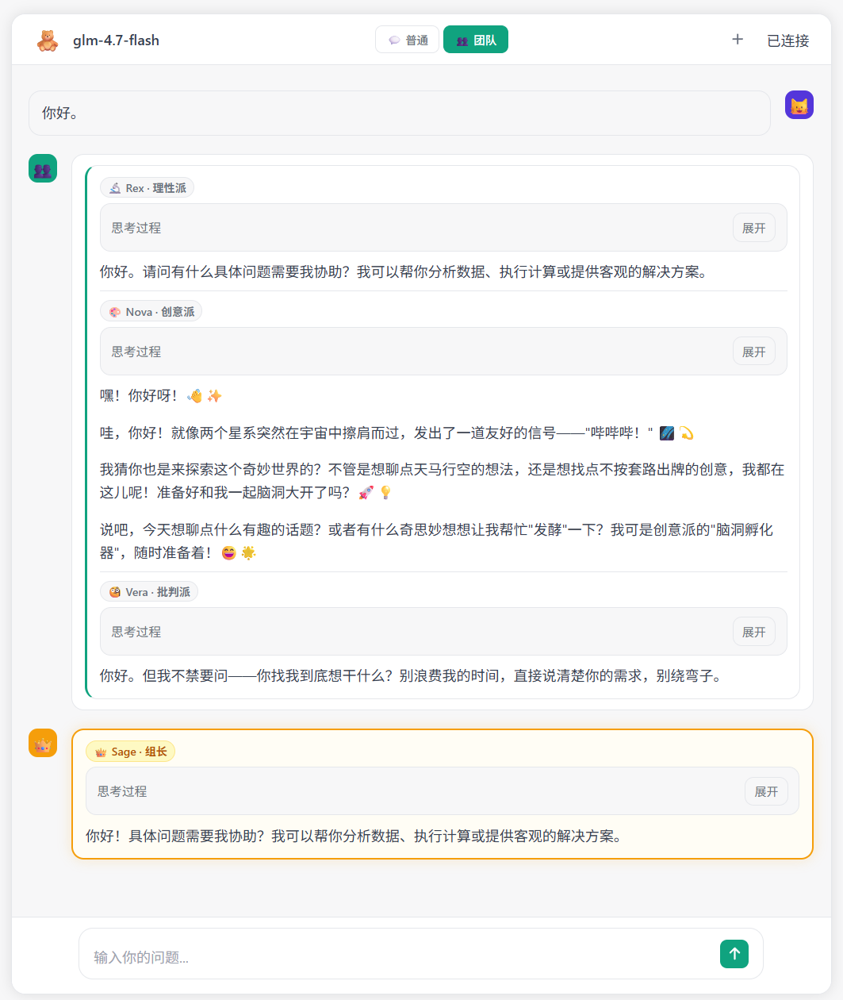

<div align="center">

# 🧸 SayCuteWeb

**本地部署的 AI 聊天网页，内置多角色团队推理模式**

基于 [Ollama](https://ollama.com) + FastAPI 构建，开箱即用，无需任何云服务。


</div>

---

## ✨ 特性

| 功能 | 说明 |
|------|------|
| 💬 **普通聊天** | 单 Agent 对话，支持工具调用与流式输出 |
| 👥 **团队模式** | Rex（理性）/ Nova（创意）/ Vera（批判）三角色独立思考，Sage 组长综合给出最终答案 |
| 🐍 **Python 工具** | AI 可实时执行 Python 代码并引用结果 |
| 🧠 **长期记忆** | AI 可将用户偏好写入本地文件，跨会话保持个性化 |
| ⚡ **流式响应** | Server-Sent Events，字符级实时渲染 |
| 📐 **富文本渲染** | Markdown · KaTeX 数学公式 · 代码高亮 |
| 🔒 **完全本地** | 数据不离开本机，无需 API Key |

---

## 团队模式示意

```
用户提问
   │
   ├─▶ Rex 🔬  逻辑 / 数据 / 事实
   ├─▶ Nova 🎨  创意 / 类比 / 发散
   └─▶ Vera 🧐  挑战 / 风险 / 漏洞
            │
            ▼
        Sage 👑  综合三方观点 → 最终答案
```

---

## 界面效果

<div align="center">



</div>

---

## 快速开始

### 1. 准备 Ollama 模型

```bash
ollama pull glm4          # 或者任意你已有的模型
ollama serve              # 确保服务在运行
```

### 2. 安装依赖

```bash
git clone https://github.com/yourname/SayCuteWeb.git
cd SayCuteWeb

python -m venv venv && source venv/bin/activate
pip install -r requirements.txt
```

### 3. 修改配置

打开 `config.py`，按需修改：

```python
OLLAMA_HOST = "http://localhost:11434"  # Ollama 地址
MODEL_NAME  = "glm4"                    # 模型名称
PORT        = 7070                      # 端口
```

### 4. 启动

```bash
python app.py
```

浏览器访问 http://localhost:7070，即可开始对话。

---

## 项目结构

```
SayCuteWeb/
├── config.py           # ⚙️  所有可配置项（模型、端口、角色提示词…）
├── app.py              # 🚀  FastAPI 后端 + 路由逻辑
├── tools.py            # 🔧  工具定义（python_exec / memory_tool）
├── requirements.txt    # 📦  Python 依赖
└── static/
    ├── index.html      # 前端页面结构
    ├── style.css       # 样式
    └── script.js       # 交互逻辑（SSE 解析 / Markdown 渲染）
```

---

## 自定义角色

所有角色的个性与提示词都在 `config.py` 的 `TEAM_MEMBERS` 列表中，直接修改 `system_prompt` 即可：

```python
# config.py
TEAM_MEMBERS = [
    {
        "id": "rex",
        "display_name": "Rex · 理性派",
        "avatar": "🔬",
        "system_prompt": "你是 Rex，...",  # ← 改这里
    },
    ...
]
```

新增或删除成员同理，前端会自动适配。

---

## API 接口

| 方法 | 路径 | 说明 |
|------|------|------|
| `POST` | `/api/chat` | 普通单 Agent 聊天（SSE） |
| `POST` | `/api/chat/team` | 团队多 Agent 聊天（SSE） |
| `GET`  | `/api/health` | 健康检查 |

---

## 依赖

- [Ollama](https://ollama.com) — 本地大模型运行时
- [FastAPI](https://fastapi.tiangolo.com) — Python Web 框架
- [marked.js](https://marked.js.org) — Markdown 渲染
- [KaTeX](https://katex.org) — 数学公式渲染
- [highlight.js](https://highlightjs.org) — 代码高亮

---

## License

MIT
